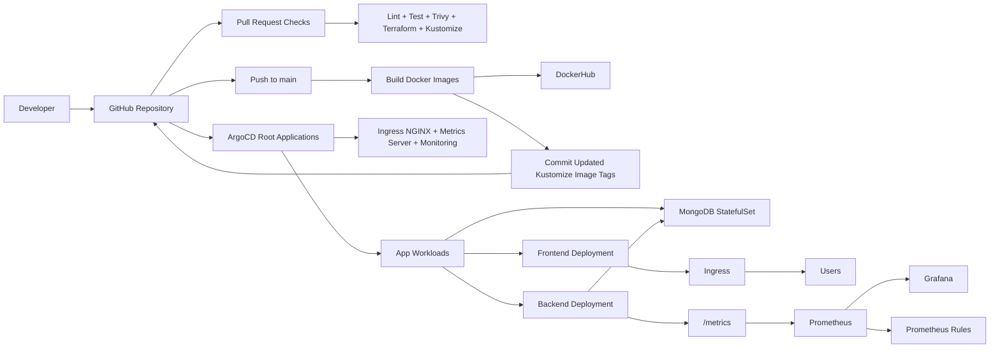
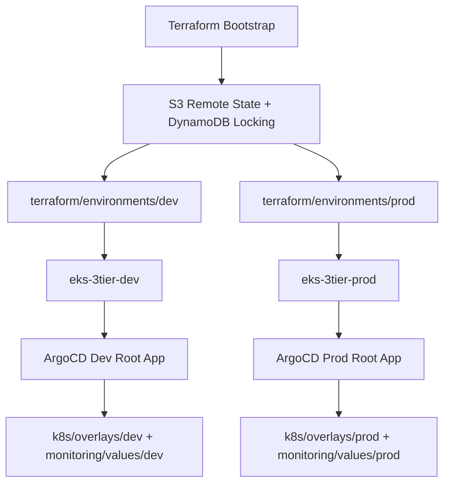

# EKS 3-Tier DevOps Project

Production-grade DevOps project for a React frontend, Node.js backend, and MongoDB database on Amazon EKS using Terraform, GitHub Actions, Docker, ArgoCD, Kubernetes, Prometheus, and Grafana.

## Architecture

### Platform overview



### Environment layout



## What Is Included

- Reusable Terraform modules for remote state, VPC, and EKS.
- Separate `dev` and `prod` environment stacks.
- Kustomize `base`, `dev`, and `prod` workload manifests.
- ArgoCD app-of-apps pattern with auto-sync and self-heal enabled.
- Prometheus and Grafana with backend metrics, alerts, and dashboard config.
- GitHub Actions for CI, image build, Trivy scanning, manifest promotion, and prod release.
- Docker Compose for full local execution.

## Repository Layout

```text
.
|-- .github/
|   |-- workflows/
|   |-- CODEOWNERS
|   `-- pull_request_template.md
|-- argocd/
|   |-- application.yaml
|   |-- application-prod.yaml
|   `-- apps/
|-- backend/
|-- frontend/
|-- k8s/
|   |-- base/
|   `-- overlays/
|-- monitoring/
|   |-- base/
|   |-- overlays/
|   `-- values/
|-- terraform/
|   |-- bootstrap/
|   |-- environments/
|   `-- modules/
|-- screenshots/
|-- scripts/
|-- docker-compose.yml
|-- Makefile
|-- eksctl_commands.md
|-- troubleshooting.md
`-- FINAL_PROJECT_STATUS.md
```

## Versions

- Amazon EKS Kubernetes `1.35`
- Terraform AWS provider `6.39.0`
- `terraform-aws-modules/vpc/aws` `6.6.1`
- `terraform-aws-modules/eks/aws` `21.14.0`
- Ingress NGINX chart `4.15.1`
- Metrics Server chart `3.13.0`
- `kube-prometheus-stack` chart `83.5.1`
- Node.js runtime `22`

## Local Run

```bash
docker compose up --build
```

Endpoints:

- Frontend: `http://localhost:3000`
- Backend health: `http://localhost:5000/healthz`
- MongoDB: `mongodb://localhost:27017`

## Zero-to-Production Deployment

### 1. Prepare prerequisites

- AWS CLI authenticated to the target account
- Docker installed and logged in
- Terraform installed
- `kubectl` installed
- Access to GitHub repository settings

### 2. Configure repository secrets and variables

Repository variable:

- `DOCKERHUB_NAMESPACE`

Repository secrets:

- `DOCKERHUB_USERNAME`
- `DOCKERHUB_TOKEN`
- `AWS_ACCESS_KEY_ID`
- `AWS_SECRET_ACCESS_KEY`
- `ARGOCD_SERVER`
- `ARGOCD_AUTH_TOKEN`

See [.env.example](/C:/Users/shiva/OneDrive/Desktop/eks-3tier-devops-project/.env.example) for the complete example set.

### 3. Create remote state backend

```powershell
terraform -chdir=terraform/bootstrap init
terraform -chdir=terraform/bootstrap apply
```

### 4. Initialize and apply the dev stack

```powershell
$STATE_BUCKET = terraform -chdir=terraform/bootstrap output -raw state_bucket_name
$LOCK_TABLE = terraform -chdir=terraform/bootstrap output -raw lock_table_name

terraform -chdir=terraform/environments/dev init `
  -backend-config="bucket=$STATE_BUCKET" `
  -backend-config="dynamodb_table=$LOCK_TABLE" `
  -backend-config="region=us-east-1" `
  -backend-config="key=dev/terraform.tfstate"

terraform -chdir=terraform/environments/dev apply
```

### 5. Initialize and apply the prod stack

```powershell
$STATE_BUCKET = terraform -chdir=terraform/bootstrap output -raw state_bucket_name
$LOCK_TABLE = terraform -chdir=terraform/bootstrap output -raw lock_table_name

terraform -chdir=terraform/environments/prod init `
  -backend-config="bucket=$STATE_BUCKET" `
  -backend-config="dynamodb_table=$LOCK_TABLE" `
  -backend-config="region=us-east-1" `
  -backend-config="key=prod/terraform.tfstate"

terraform -chdir=terraform/environments/prod apply
```

### 6. Update kubeconfig

```bash
aws eks update-kubeconfig --region us-east-1 --name eks-3tier-dev
aws eks update-kubeconfig --region us-east-1 --name eks-3tier-prod
```

### 7. Install ArgoCD on each cluster

```bash
kubectl create namespace argocd
kubectl apply -n argocd -f https://raw.githubusercontent.com/argoproj/argo-cd/stable/manifests/install.yaml
kubectl rollout status deployment/argocd-server -n argocd
```

### 8. Bootstrap root ArgoCD applications

Development cluster:

```bash
kubectl apply -f argocd/application.yaml
```

Production cluster:

```bash
kubectl apply -f argocd/application-prod.yaml
```

### 9. Push application changes

When you push to `main`:

1. GitHub Actions runs lint, tests, Terraform checks, Kustomize renders, Docker builds, and Trivy scans.
2. The `Deploy Dev` workflow builds and pushes backend and frontend images to DockerHub.
3. The workflow updates `k8s/overlays/dev/kustomization.yaml` with the new image tags and commits that GitOps change.
4. ArgoCD auto-syncs the dev application because auto-sync and self-heal are enabled.

### 10. Promote to production

Use the `Promote Prod` workflow and provide the already-built image tag from the dev deployment. That workflow updates the prod overlay, commits the GitOps change, and ArgoCD syncs the prod application.

## GitHub Actions Behavior

### `Branch Protection`

- Runs on PRs to `main`
- Uses the reusable quality workflow
- Intended to be marked as a required status check

### `Reusable Quality Gates`

- Backend lint and test
- Frontend lint and test
- Terraform `fmt` and `validate`
- Kustomize render validation
- Docker Compose validation
- Docker build validation
- Trivy filesystem scan

### `Deploy Dev`

- Runs on `main`
- Builds and pushes Docker images
- Scans images with Trivy
- Updates the dev Kustomize overlay automatically
- Commits back to the repo
- ArgoCD auto-syncs from Git

### `Promote Prod`

- Manual promotion with a chosen image tag
- Updates the prod Kustomize overlay
- Commits back to the repo
- ArgoCD auto-syncs from Git

## GitOps and ArgoCD

- Root dev app: [argocd/application.yaml](/C:/Users/shiva/OneDrive/Desktop/eks-3tier-devops-project/argocd/application.yaml)
- Root prod app: [argocd/application-prod.yaml](/C:/Users/shiva/OneDrive/Desktop/eks-3tier-devops-project/argocd/application-prod.yaml)
- Child apps install ingress, metrics server, monitoring, and workloads.
- Every child app enables `automated.prune: true`.
- Every child app enables `automated.selfHeal: true`.
- Every child app uses `CreateNamespace=true`.

## Monitoring

- Helm values are environment-specific in [monitoring/values/dev.yaml](/C:/Users/shiva/OneDrive/Desktop/eks-3tier-devops-project/monitoring/values/dev.yaml) and [monitoring/values/prod.yaml](/C:/Users/shiva/OneDrive/Desktop/eks-3tier-devops-project/monitoring/values/prod.yaml).
- Grafana dev ingress host: `grafana.dev.eks-3tier.internal`
- Grafana prod ingress host: `grafana.eks-3tier.internal`
- Backend metrics are scraped via ServiceMonitor resources in [monitoring/overlays](</C:/Users/shiva/OneDrive/Desktop/eks-3tier-devops-project/monitoring/overlays>).

## Cost Estimate

Estimated monthly cost in `us-east-1`, assuming 730 hours/month and standard-support EKS versions. These figures are approximate and based on current AWS pricing pages plus direct inference for the chosen EC2 shapes.

| Resource | Dev estimate | Prod estimate |
|---|---:|---:|
| EKS control plane | ~$73 | ~$73 |
| NAT Gateway | ~$33 for 1 NAT | ~$99 for 3 NATs |
| Worker nodes | ~$18-$30 with 2 `t3.medium` Spot nodes | ~$210 with 3 `m6i.large` On-Demand nodes |
| MongoDB gp3 storage | ~$0.80 for 10 GiB | ~$4.00 for 50 GiB |
| Load balancer / ingress | ~$20-$30 | ~$20-$30 |
| CloudWatch, data transfer, Grafana usage overhead | variable | variable |
| Approximate total | ~$145-$195/month | ~$406-$466/month |

Cost assumptions were informed by current AWS pricing pages for EKS, NAT Gateway, ELB, and EBS gp3, plus standard on-demand/spot expectations for the EC2 instance sizes selected:

- [Amazon EKS pricing / FAQ](https://aws.amazon.com/eks/faqs/)
- [NAT Gateway pricing](https://docs.aws.amazon.com/en_us/vpc/latest/userguide/nat-gateway-pricing.html)
- [Elastic Load Balancing pricing](https://aws.amazon.com/elasticloadbalancing/pricing/)
- [EBS pricing](https://aws.amazon.com/ebs/pricing/)
- [EC2 pricing](https://aws.amazon.com/ec2/pricing/)

## Validation Commands

### Terraform

```bash
terraform fmt -check -recursive terraform
terraform -chdir=terraform/bootstrap init -backend=false
terraform -chdir=terraform/bootstrap validate
terraform -chdir=terraform/environments/dev init -backend=false
terraform -chdir=terraform/environments/dev validate
terraform -chdir=terraform/environments/prod init -backend=false
terraform -chdir=terraform/environments/prod validate
```

### Kubernetes

```bash
kubectl kustomize k8s/overlays/dev
kubectl kustomize k8s/overlays/prod
kubectl kustomize monitoring/overlays/dev
kubectl kustomize monitoring/overlays/prod
kubectl kustomize k8s/overlays/dev > /tmp/dev-rendered.yaml
kubectl kustomize k8s/overlays/prod > /tmp/prod-rendered.yaml
kubectl apply --dry-run=client --validate=false -f /tmp/dev-rendered.yaml
kubectl apply --dry-run=client --validate=false -f /tmp/prod-rendered.yaml
```

### Docker

```bash
docker build -t eks-3tier-backend:test ./backend
docker build -t eks-3tier-frontend:test ./frontend
docker compose config --quiet
```

## Cleanup and Destroy

### Delete ArgoCD applications

```bash
kubectl delete -f argocd/application.yaml --ignore-not-found
kubectl delete -f argocd/application-prod.yaml --ignore-not-found
```

### Destroy prod infrastructure

```powershell
terraform -chdir=terraform/environments/prod destroy
```

### Destroy dev infrastructure

```powershell
terraform -chdir=terraform/environments/dev destroy
```

### Destroy remote state backend last

```powershell
terraform -chdir=terraform/bootstrap destroy
```

### Remove local containers

```bash
docker compose down -v
docker image rm eks-3tier-backend:local-verify eks-3tier-frontend:local-verify
```

## Screenshots

Capture and store these in [screenshots/README.md](/C:/Users/shiva/OneDrive/Desktop/eks-3tier-devops-project/screenshots/README.md):

- GitHub Actions successful dev deployment run
- ArgoCD application tree with healthy sync state
- Grafana dashboard showing backend metrics
- `kubectl get pods -A` after deployment

## Security Highlights

- Trivy filesystem and image scanning
- Non-root frontend and backend containers
- Kubernetes Secrets for application credentials
- Encrypted S3 state bucket with TLS-only policy
- DynamoDB state locking with SSE enabled
- IRSA for the EBS CSI driver
- Pod probes, resource limits, and autoscaling

## Interview Talking Points

- End-to-end GitOps flow from GitHub push to EKS deployment
- Reusable Terraform module design and separated environments
- Shift-left validation with Terraform, Kustomize, Docker, and Trivy
- Observability path using Prometheus, Grafana, alerts, and app metrics
- Safe promotion model from dev to prod via Git-managed overlays
